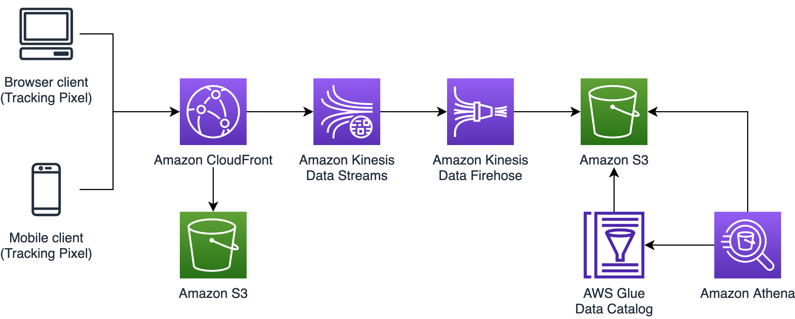

# Tracking pixel solution at the edge on AWS

This solution builds an edge solution using Amazon CloudFront with real-time logs.
When a HTTP request is made to serve a 1x1 transparent pixel HTML `` tag, fields 
are logged such as `c-ip`, `timestamp`, `cs-uri-query`, etc.. Real-time logs 
integrates with Kinesis Data Streams which is then delivered to Kinesis Data Firehose 
to store in S3 for future processing.

## Solution Architecture



## Requirements

- AWS CDK 2.89.x
- Configured AWS credentials

## Deploy on AWS

1. Clone git repository and navigate to CDK project

```bash
git clone https://github.com/aws-samples/amazon-cloudfront-pixel-tracking.git
cd amazon-cloudfront-pixel-tracking
```

2. Install CDK

```bash
npm install
```

3. Run CDK commands to bootstrap, synthesize, and deploy the CDK stack

```bash
cdk bootstrap
cdk synth
cdk deploy
```

4. After deploying, CDK will give you the new CloudFront distribution. Update 
`webpage/index.html` with the newly created CloudFront distribution. You can save 
and deploy with CDK or go directly to S3 and make the changes via the console.

## How to use

CloudFront real-time logs are configurable and require specifying the fields to log. This 
example is set up to log the following fields:
* `timestamp`: The date and time at which the edge server finished responding to the request.
* `c-ip`: The IP address of the viewer that made the request.
* `cs-uri-query`: The query string portion of the request URL which is how we can collect other information.

Once customized, you can directly begin tracking interactions from web pages or 
emails from an HTML IMG tag, or from any other event producer you might consider 
by generating HTTP-GET requests to the URL of the template output. As an 
example, this would be an HTTP call for the example implementation:

```bash
curl -G -d 'userid=aws_user' -d 'thirdpartyname=example.hightrafficwebsite.com' https://<your template output domain>/1x1.png
```

## Testing CDK constructs
```
npm run test
```

## Cleanup

In the `amazon-cloudfront-pixel-tracking` subdirectory of the cloned repository, delete the deployed resources:

```bash
cdk destroy
```

Please be aware that some resources aren't automatically deleted and either 
need a retention policy that allows deletes or you need to delete them manually 
in you AWS account. 

## Security

See [CONTRIBUTING](CONTRIBUTING.md#security-issue-notifications) for more information.

## License

This sample code is licensed under the MIT-0 License. See the LICENSE file.
